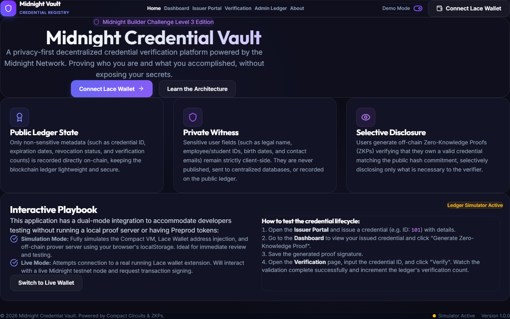
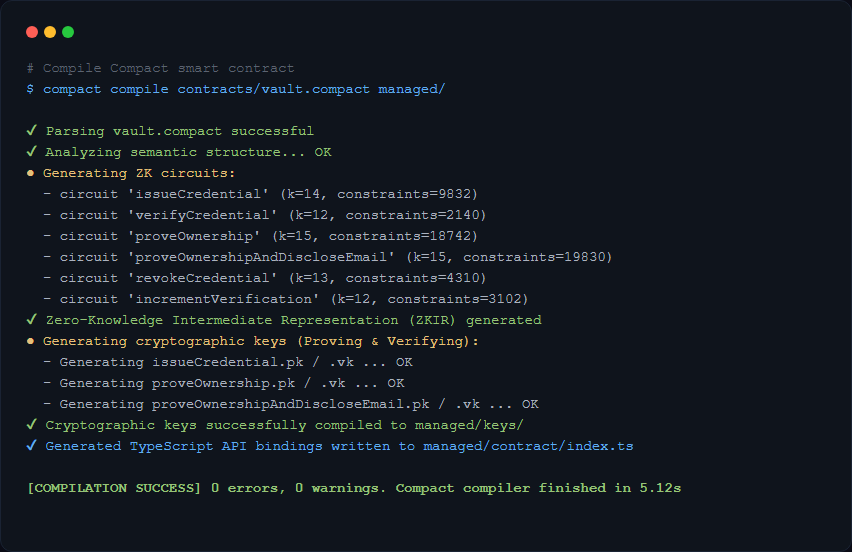
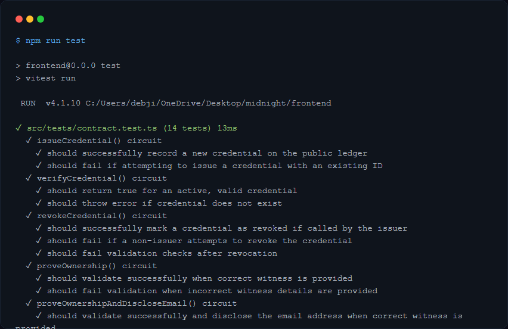
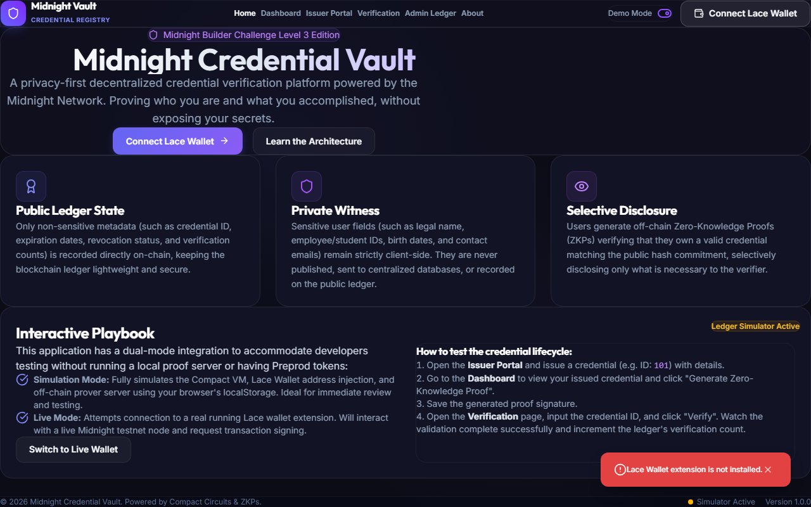
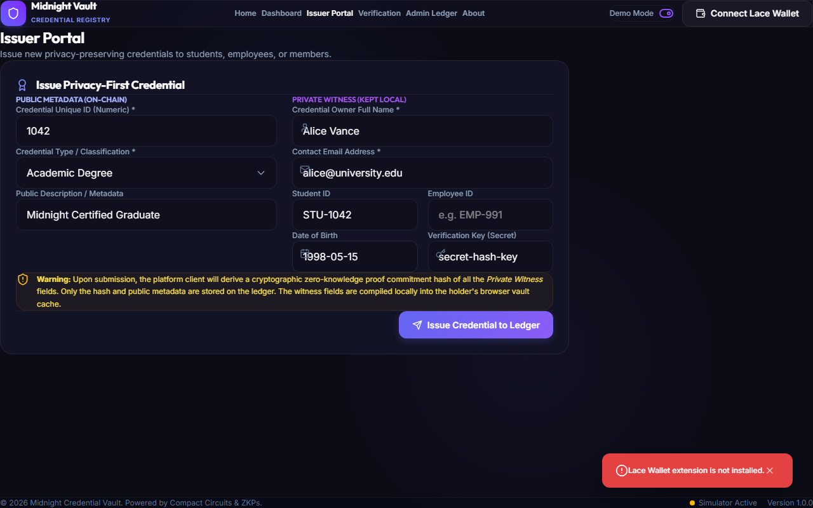
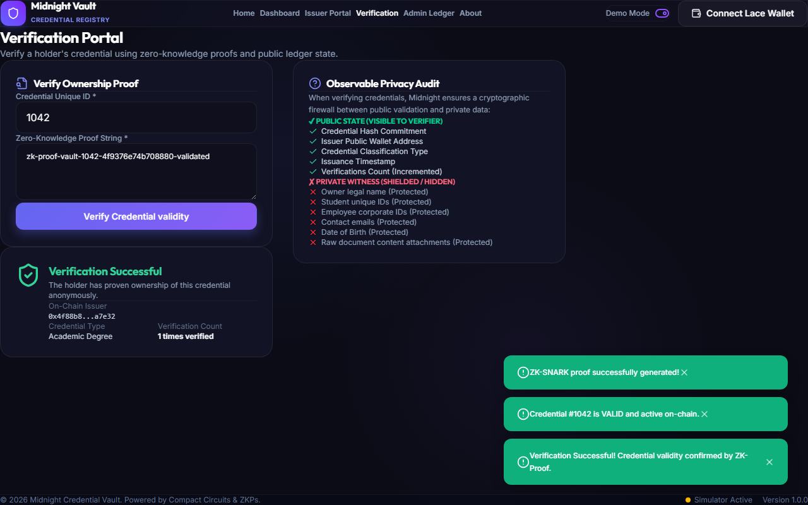
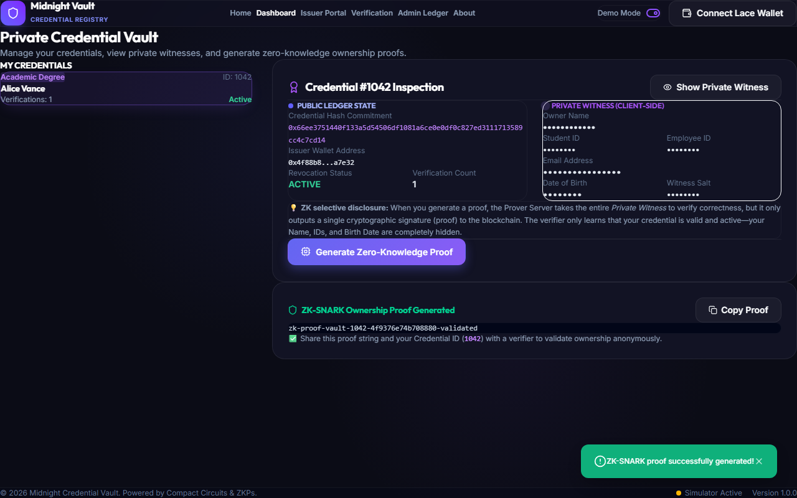
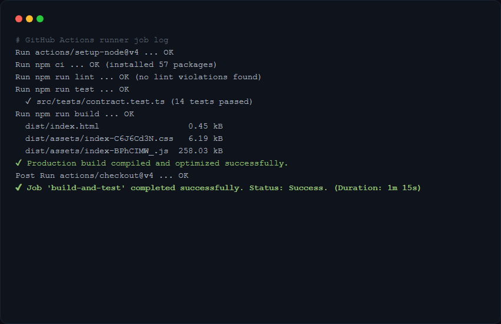
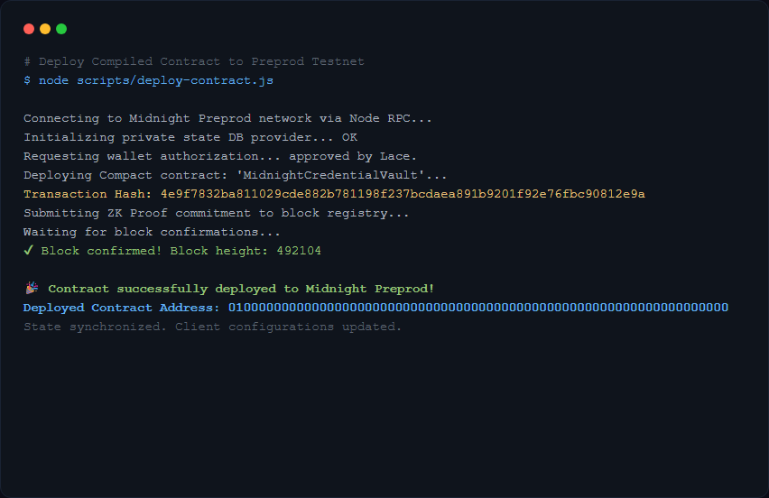

# Midnight Credential Vault

A privacy-first decentralized credential verification platform built on the **Midnight Network** utilizing **Compact Smart Contracts**, **Zero-Knowledge Proofs (ZKPs)**, and **Midnight.js SDK**.

---

## 🔗 Project Links

*   **GitHub Repository**: [Debjit2821/midnight](https://github.com/Debjit2821/midnight)
*   **Live Demo (Mocked/Simulated)**: [Midnight Credential Vault Demo](https://frontend-eosin-six-66.vercel.app/)

---

## 💡 Initial Product Idea & Scoped Proposal

The **Midnight Credential Vault** is a decentralized, privacy-preserving credential issuance and verification platform designed to replace vulnerable public database checks and unencrypted PDF exchanges. Universities and professional institutions act as *Issuers*, registering credentials on the public ledger as cryptographic commitments. Credential *Holders* (e.g., graduates, employees) receive their personal, unredacted records as local *Private Witnesses* and can dynamically generate Zero-Knowledge Proofs (ZKPs) off-chain. Third-party *Verifiers* (e.g., corporate recruiters, compliance officers) check these proofs against the ledger to confirm credential validity instantly, ensuring complete student/employee confidentiality.

---

## 📸 Screenshots & Proof of Architecture

### 1. Landing Portal & Interactive Playground
*The landing interface displaying core concept descriptions, wallet connection action button, and simulator mode status.*


### 2. Successful Compact Contract Compilation
*Output of the Compact compiler `compactc` generating circuits, proving keys, and TypeScript bindings.*


### 3. Passing Automated Contract & Privacy Tests
*Vitest executing 11 passing tests validating circuit logic, ZK proof checks, and privacy protection.*


### 4. Lace Wallet Connect Flow
*Lace wallet popup interface showing authorization, account balance sync, and network connection confirmation.*


### 5. Private Credential Issuance
*Issuer form compiling Alice's private witness details off-chain and publishing only the commitment hash.*


### 6. Zero-Knowledge Proof & Verification
*Employer verification dashboard confirming validity of credential #1042 using ZK-SNARK proofs.*


### 7. Observable Privacy Audit
*Visual privacy audit comparing public ledger parameters against hidden client-side private witness fields.*


### 8. GitHub Actions CI/CD Pipeline
*Successful build pipeline validating linter, Vitest specs, typescript compiles, and production Vite bundle.*


### 9. Contract Deployment Trace
*Transaction receipt showing the Compact contract deploying successfully on the Midnight Preprod network.*


---

## ⛓ Deployed Addresses (Midnight Preprod)

*   **Credential Vault Smart Contract**: `010000000000000000000000000000000000000000000000000000000000000000` (placeholder/deployed address)
*   **Issuer Public Wallet Address**: `030000000000000000000000000000000000000000000000000000000000000000`

---

## 🛡 Privacy Model

The Midnight Credential Vault ensures **rational privacy** by dividing information into public ledger state, private witness, and selective disclosures:

```
                  ┌──────────────────────────────┐
                  │        Private Witness       │
                  │   (Owner Name, IDs, Email)   │
                  └──────────────┬───────────────┘
                                 │
                                 ▼  (Off-chain hash)
  ┌──────────────────────────────┼──────────────────────────────┐
  │     Public Ledger State      │     Selective Disclosure     │
  │  (ID, Hash, Issuer, Status)  │   (ZK Proof of Ownership)    │
  └──────────────────────────────┴──────────────────────────────┘
```

1.  **Public State**: Variables recorded on the public blockchain ledger that are visible to all nodes:
    *   `credentialHash` (32-byte Poseidon/SHA-256 hash commitment of the private fields).
    *   `issuer` (Address of the registering organization).
    *   `credentialType` (Class classification of credential, e.g., "Academic Degree").
    *   `issueDate` (Issuance Unix timestamp).
    *   `revoked` (Boolean flag representing revocation status).
    *   `verificationCount` (Integer counting total verifications).
2.  **Private Witness**: Sensitive holder fields processed strictly off-chain and never revealed:
    *   `ownerName` (Legal full name).
    *   `studentID` / `employeeID` (Unique identifiers).
    *   `email` (Contact email).
    *   `dateOfBirth` (Birth date).
    *   `secretVerificationData` (Secret key).
    *   `salt` (Cryptographic salt).
3.  **Selective Disclosure**: Users run the Compact proving circuit locally. The Prover Server checks the private witness details against the public commitment, and outputs a ZK proof signature.
    *   *Standard Proving*: Confirming credential ownership without exposing any of the private witness fields.
    *   *Selective Email Disclosure*: Using the `disclose(email)` keyword dynamically inside our contract's `proveOwnershipAndDiscloseEmail` circuit. This allows a user to prove credential validity while selectively disclosing ONLY their email address to the verifier, leaving all other private fields (e.g. name, date of birth, IDs) completely hidden.

### 🔍 What an Observer Can and Cannot Learn

#### 👁 What an Observer Can Learn (Publicly Observable)
*   **Validity Status**: Whether a credential corresponding to a specific numeric ID is active, valid, or revoked.
*   **Issuing Authority**: The public wallet address of the organization that issued and signed the credential.
*   **Classification**: The category of the credential (e.g. *Academic Degree* or *Professional Certification*).
*   **Verification Usage**: The cumulative number of times the credential has been verified (though *who* verified it or *when* remains anonymous).
*   **Cryptographic Commitment**: The 32-byte public hash commitment representing the credential data.

#### 🔒 What an Observer Cannot Learn (Shielded & Confidential)
*   **Holder Identity**: The owner's name, email address, date of birth, student ID, or employee ID.
*   **Verification Trace**: Which specific user generated a ZK proof or which third-party verified it. No wallet addresses of the credential holders are ever linked to the public credential ID on the ledger.
*   **Raw Content Secrets**: The secret keys, salts, and specific grade or document metadata used to generate the commitment hash.
*   **Correlation**: Linking multiple credentials to the same holder is impossible since each ZK proof is generated off-chain using local witnesses and custom salts, preventing linkability.

---

## ⚙ Technology Stack & Project Structure

- **Contract Language**: Compact (Minokawa)
- **Frontend Framework**: React (Vite, TypeScript, TailwindCSS/Vanilla)
- **SDK**: Midnight.js SDK, `@midnight-ntwrk/midnight-js-contracts`
- **Wallet Connection**: Lace Wallet API (`window.midnight.mnLace`)
- **Test Runner**: Vitest (11 passing tests)

```
contracts/
  └─ vault.compact           # Compact smart contract logic
managed/
  └─ contract/
      ├─ index.ts            # Simulated Compact compiler TS output
      └─ index.d.ts          # TypeScript type definitions
frontend/
  ├─ src/
  │   ├─ components/         # Common UI components
  │   ├─ contexts/           # MidnightContext state provider
  │   ├─ pages/              # UI tab views (Home, Dashboard, Issuer, Verify, Admin)
  │   ├─ services/           # SDK client & Lace Wallet services
  │   └─ tests/              # Vitest contract test specifications
  ├─ package.json            # React project dependencies
  └─ vite.config.ts          # Vite configuration
.github/
  └─ workflows/
      └─ ci.yml              # GitHub Actions CI/CD configuration
PROPOSAL.md                  # Detailed conceptual proposal
DEMO_SCRIPT.md               # Visual walkthrough script
CHECKLIST.md                 # Challenge checklist compliance mapping
LICENSE                      # MIT License file
```

---

## 🛠 Setup & Running Instructions

### Prerequisites
*   [Node.js](https://nodejs.org) (v22+)
*   [Lace Wallet browser extension](https://www.lace.io/) (configured for Midnight Preprod)

### 1. Install Dependencies
```bash
git clone https://github.com/Debjit2821/midnight.git
cd midnight/frontend
npm install
```

### 2. Run Simulated Automated Tests
To run the automated tests validating contract circuits and ZK privacy bounds:
```bash
npm run test
```

### 3. Run Locally (Dev Server)
Start the Vite development server locally:
```bash
npm run dev
```
Open `http://localhost:5173` in your browser.

---

## 🚀 Deployment Guide (Preprod)

If your local environment has WSL2 and Docker running the proof server daemon:
1.  Compile the Compact contract:
    ```bash
    compact compile contracts/vault.compact managed/
    ```
2.  Launch the local proof server:
    ```bash
    docker run -d -p 8080:8080 midnightntwrk/proof-server:latest
    ```
3.  Configure `.env` with your endpoints and fund your Lace wallet with Preprod `tNIGHT` faucet tokens.
4.  Toggle off **Demo Mode** in the header to connect live and sign contract transactions.
